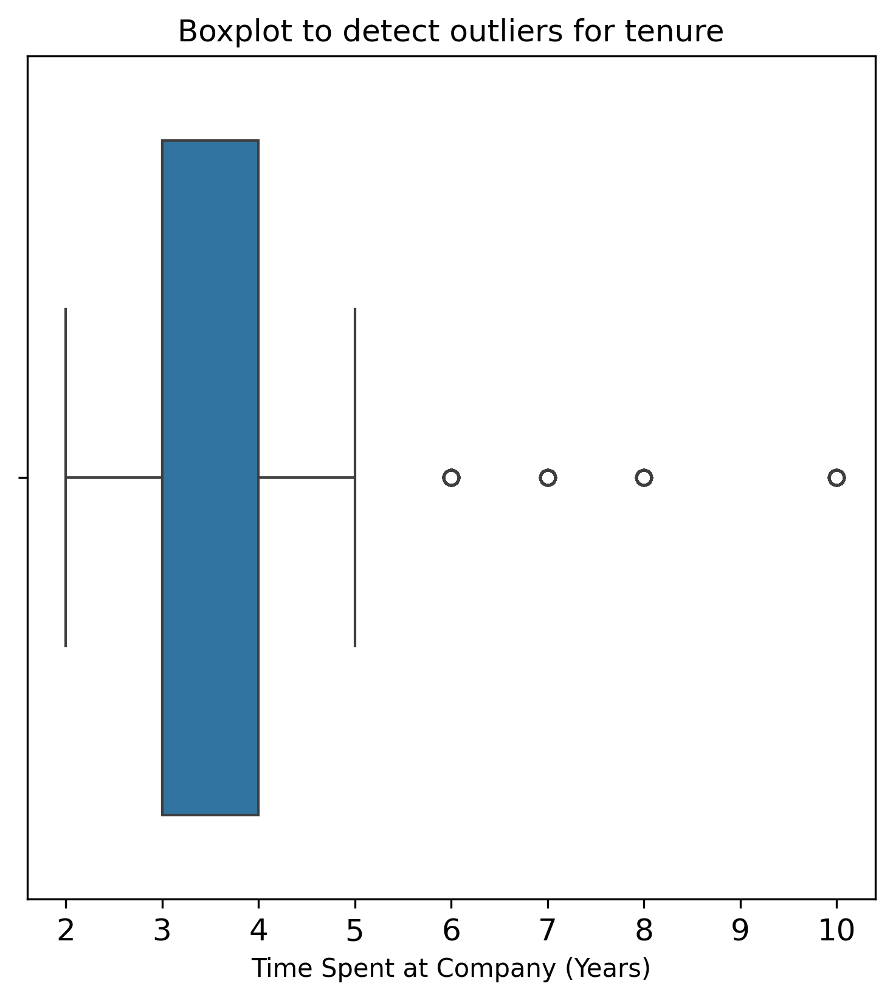
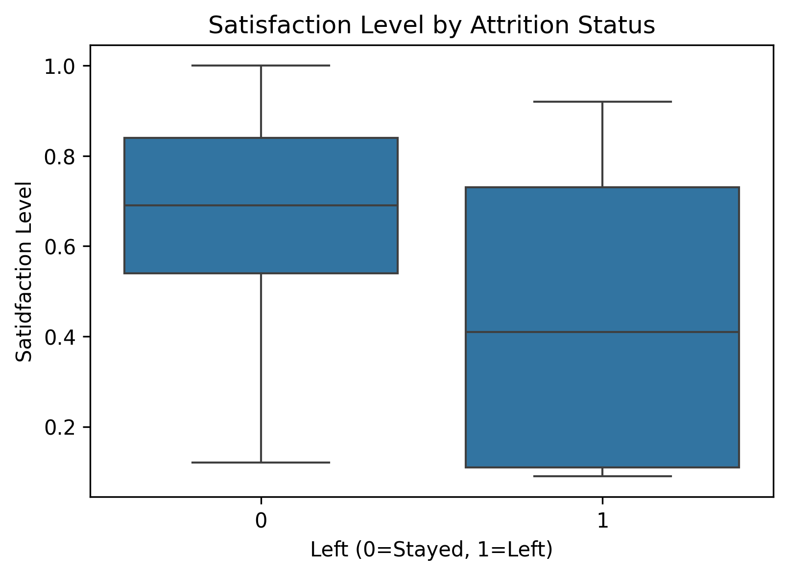

# ds-salifort-hr-attrition


# Salifort Motors – Employee Attrition Analysis

This repository contains an end-to-end analysis of employee attrition data for Salifort Motors. The goal is to understand the factors associated with voluntary turnover and build a predictive model that can help HR identify employees at higher risk of leaving.

## Project Overview

**Business problem**

Employee turnover is costly. Salifort Motors wants to:

- Understand what drives employees to leave.
- Identify employees who may be at higher risk of attrition.
- Use these insights to design targeted retention strategies.

**Objectives**

- Explore relationships between satisfaction, workload, performance, and attrition.
- Train and evaluate classification models to predict attrition.
- Provide interpretable insights and recommendations for HR.

## Data

The dataset includes one record per employee with features such as:

- Satisfaction level and last performance evaluation
- Number of projects and average monthly hours
- Time spent at the company (tenure)
- Work accidents and promotions in the last five years
- Salary level (categorical)
- Target label indicating whether the employee left

Raw and processed data files are stored in the `data/` directory (filenames redacted or anonymized as needed).

## Methods

The analysis is implemented in Python using:

- **pandas**, **NumPy** – data loading and preparation
- **Matplotlib**, **Seaborn** – visualization and EDA
- **scikit-learn** – model training and evaluation (logistic regression, tree-based models)
- Standard metrics: accuracy, precision, recall, F1-score, ROC-AUC

The workflow includes:

1. Data understanding and cleaning
2. Exploratory data analysis (EDA)
3. Feature engineering and encoding of categorical variables
4. Model training and hyperparameter tuning
5. Model evaluation and feature importance analysis
6. Business-focused interpretation and recommendations
### 📊 Visualizations

| Plot | Preview |
|------|---------|
| Tenure Distribution |  |
| Attrition Heatmap   |  |


## Folder structure

<!-- FOLDER_STRUCTURE_START -->

```text
.
├── data
│   └── HR_capstone_dataset.csv
├── experiment_models
│   ├── best_random_forest.pkl
│   └── rf1_gridsearch.pkl
├── models
│   └── best_random_forest.pkl
├── README.md
├── reports
│   └── figures
│       ├── satisfaction_boxplot.png
│       └── tenure_boxplot.png
├── Salifort Motors project lab.ipynb
└── update_structure.sh

6 directories, 9 files
```

<!-- FOLDER_STRUCTURE_END -->

